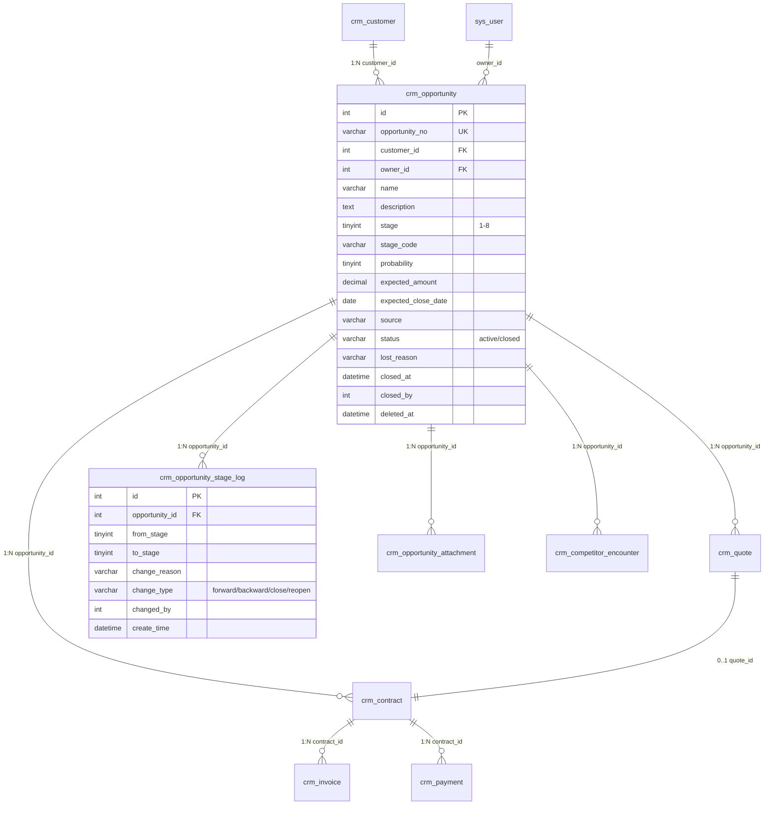

# 商机（Opportunity）领域设计

> 设计日期：2026-08-04
> 基线：Customer Center v1.0（已冻结，见 [docs/customer-center-freeze-v1.md](file:///c:/huakey-crm/docs/customer-center-freeze-v1.md)）
> 当前分支：`refactor/customer-module-template`
> 最新迁移编号：101（下一编号从 102 起）
> 设计原则：基于现有代码与文档，不重新设计已存在功能，不修改 Customer 模块
> 状态：**已被 [Opportunity Center v1 MVP Scope](file:///c:/huakey-crm/docs/opportunity-center-v1-mvp-scope.md) 取代为开发基线**
> ⚠️ 本文档为完整设计草稿（Design Draft），保留作为参考。实际开发以 MVP Scope 为准。

---

## 0. 设计约束（不可逾越）

| 约束 | 来源 |
|------|------|
| Customer Center v1.0 已冻结 | 只允许读取 `crm_customer` 数据，禁止修改其表结构、字段名、权限码、API 契约 |
| 命名规范统一 | 全项目 CRUD 使用 `add/edit/delete`，禁止 `create/update/remove`（见 [docs/customer-permission-standard.md](file:///c:/huakey-crm/docs/customer-permission-standard.md)） |
| MySQL 8.0 语法 | 参数占位符 `?`，`pool.query()`，禁用 `$$` / `DELIMITER` / `CREATE PROCEDURE` |
| API 响应统一格式 | `{ code, message, data }` |
| 软删除约定 | 所有业务表使用 `deleted_at DATETIME DEFAULT NULL` |
| 数据权限 | 列表/详情查询必须接受 `permission` 子句，count 查询必须包含 `permParams` |
| 集成响应脱敏 | 敏感配置必须脱敏 |
| 路由权限双中间件 | `authenticateToken` + `checkPermission` / `checkDataPermission` |
| Demo 数据体系 | 新表需通过迁移加 `is_demo TINYINT(1) NOT NULL DEFAULT 0` |

---

## 1. 当前状态分析（Current Opportunity Status）

### 1.1 已存在的实现

**数据库表**：

| 表名 | 用途 | 关键字段 | 来源 |
|------|------|----------|------|
| `crm_opportunity` | 商机主表 | id / customer_id / name / expected_amount / expected_date / stage(TINYINT 1-6) / win_rate / remark / owner_id / create_time / update_time / deleted_at | init-complete.sql:1053-1078 |
| `crm_opportunity_stage_log` | 阶段变更日志 | id / opportunity_id / from_stage / to_stage / changed_by / create_time | migration 011 |

**后端**：

| 文件 | 路径 | 状态 |
|------|------|------|
| Service | [backend/services/opportunityService.js](file:///c:/huakey-crm/backend/services/opportunityService.js) | ✅ 完整：listOpportunities / getOpportunity / createOpportunity / updateOpportunity / deleteOpportunity / advanceStage / getFunnelStats / getStageStats / getStageLog / createQuoteFromOpportunity / createContractFromOpportunity / getTimeline |
| Controller | [backend/controllers/opportunityController.js](file:///c:/huakey-crm/backend/controllers/opportunityController.js) | ✅ 存在 |
| Routes | [backend/routes/opportunity.js](file:///c:/huakey-crm/backend/routes/opportunity.js) | ✅ 9 个端点（list/add/update/update-stage/stage-log/stage-stats/delete/detail/funnel/timeline），挂载于 `/api/v1/opportunity` |
| Tests | [backend/tests/opportunity.test.js](file:///c:/huakey-crm/backend/tests/opportunity.test.js) | ⚠️ 覆盖薄弱，仅 list 成功路径 + add 字段校验失败路径，未覆盖详情/更新/删除/阶段推进/转换/数据权限 |

**前端**：

| 文件 | 路径 | 状态 |
|------|------|------|
| 列表页 | [frontend/src/views/opportunity/list.vue](file:///c:/huakey-crm/frontend/src/views/opportunity/list.vue) | ✅ 含销售漏斗卡片 + 筛选 + 表格 + 新增按钮（`opportunity:add`） |
| 详情页 | ❌ 不存在 | - |
| API | [frontend/src/api/opportunity.js](file:///c:/huakey-crm/frontend/src/api/opportunity.js) | ⚠️ 仅 1 个导出：`getOpportunityTimeline`，CRUD API 直接在 list.vue 内联调用 |
| 路由 | [frontend/src/router/index.js:94-98](file:///c:/huakey-crm/frontend/src/router/index.js#L94-L98) | 单一路由 `/opportunity`，meta.permission=`opportunity` |
| 菜单 | [frontend/src/components/layout/Sidebar.vue:47](file:///c:/huakey-crm/frontend/src/components/layout/Sidebar.vue#L47) | 单一菜单项，permission=`opportunity` |

**权限定义**：

| 权限码 | 类型 | 父级 | 来源 |
|--------|------|------|------|
| `opportunity` | menu | 0 | permission_data.sql:27 |
| `opportunity:add` | button | 7 | permission_data.sql:65 |
| `opportunity:edit` | button | 7 | permission_data.sql:66 |
| `opportunity:delete` | button | 7 | permission_data.sql:67 |

**角色权限分配**（permission_data.sql:139-177）：

| 角色 | opportunity 权限范围 |
|------|---------------------|
| boss (role 1) | `all` |
| manager (role 2) | `all` |
| sales (role 3) | `dept` |
| purchase (role 4) | `self` |

### 1.2 已存在的关联模块

**Quotation（报价）**：

| 项 | 路径 / 字段 | 状态 |
|----|-------------|------|
| 表 `crm_quote` | init-complete.sql:1482-1514 | ✅ 含 `opportunity_id` 外键（ON DELETE SET NULL） |
| 关联表 `crm_quote_item` | init-complete.sql:1524-1540 | ✅ 报价项 |
| Service | [backend/services/quoteService.js](file:///c:/huakey-crm/backend/services/quoteService.js) | ✅ createQuote 支持 `opportunity_id` 参数 |
| Routes | backend/routes/quote.js | ✅ |
| 前端 | frontend/src/views/quotation/ | ✅ |

**Contract（合同）**：

| 项 | 路径 / 字段 | 状态 |
|----|-------------|------|
| 表 `crm_contract` | init-complete.sql:432-468 | ✅ 含 `opportunity_id` 外键 + `quote_id` 索引（migration 079，无外键约束） |
| Service | [backend/services/contractService.js](file:///c:/huakey-crm/backend/services/contractService.js) | ✅ |
| Routes | backend/routes/contract.js | ✅ |
| 前端 | frontend/src/views/contract/ | ✅ |

**Invoice（发票）**：

| 项 | 状态 |
|----|------|
| 表 `crm_invoice` | ✅ init-complete.sql:895-916，关联合同（contract_id），无外键约束 |
| Service / Routes | ✅ backend/services/invoiceService.js + backend/routes/invoice.js |
| 前端 | ❌ 无独立 invoice/ 视图目录 |

**Payment（回款）**：

| 项 | 状态 |
|----|------|
| 表 `crm_payment` + `crm_payment_plan` | ✅ 关联合同（contract_id） |
| Service | ✅ backend/services/paymentService.js |
| Routes | ⚠️ 内嵌于 backend/routes/contract.js |
| 前端 | ✅ frontend/src/views/payment/（index/reminders/reconciliation/analysis） |

**Order（订单）**：

| 项 | 状态 |
|----|------|
| 表 / Service / Routes / 前端 | ❌ **完全缺失** |

### 1.3 关键代码事实

1. **商机阶段模型**（opportunityService.js:11-18）：
   ```javascript
   STAGE_MAP = { 1:'询盘', 2:'需求确认', 3:'方案报价', 4:'谈判', 5:'成交', 6:'失败' }
   ```
   - 数值阶段，6 个值，无 `closed` 状态
   - `advanceStage` 限制 stage ≤ 6，且 stage 5/6 为终态不可再推进（opportunityService.js:155-157）

2. **阶段默认赢率**（opportunityService.js:21-28）：
   ```javascript
   DEFAULT_STAGE_PROBABILITY = { 1:10, 2:25, 3:50, 4:75, 5:100, 6:0 }
   ```

3. **创建商机约束**（opportunityService.js:293-299）：
   ```javascript
   if (customers[0].status !== 'signed') {
     throw new AppError(ErrorCodes.BUSINESS_VALIDATION, '只能为已签约客户创建商机...');
   }
   ```
   - ⚠️ **依赖 Customer 字段名为 `status`**，且要求 `status='signed'`
   - ⚠️ 与 Customer Center v1.0 冻结后的字段名 `business_status` 冲突（见 §11 风险分析）

4. **报价创建自动推进客户状态**（quoteService.js:107-111）：
   ```javascript
   const [customerRows] = await pool.query('SELECT status FROM crm_customer WHERE id = ? AND deleted_at IS NULL', [customer_id]);
   if (customerRows.length > 0 && customerRows[0].status === CUSTOMER_STATUS.FOLLOWING) {
     await customerService.forwardStatus(pool, customer_id, userId);
   }
   ```
   - ⚠️ 同样依赖 `status` 字段名，且跨模块修改客户状态——**违反冻结约束**

5. **商机→报价→合同链路已实现**（opportunityService.js:419-483）：
   - `createQuoteFromOpportunity`：创建报价后自动推进商机到 stage 3
   - `createContractFromOpportunity`：创建合同后自动推进商机到 stage 5

6. **历史数据补齐**（migration 080）：已为无商机关联的报价单/合同生成占位商机并回填 `opportunity_id`

---

## 2. Gap Analysis（对比 Customer Center Freeze v1）

### 2.1 已具备的能力（保留，不重复设计）

| 能力 | 现状 |
|------|------|
| 商机 CRUD | ✅ list/add/update/delete 全部就位 |
| 阶段推进 | ✅ advanceStage + 阶段日志记录 |
| 销售漏斗统计 | ✅ getFunnelStats 返回 funnel + failed |
| 阶段停留时间 | ✅ getStageStats 返回各阶段小时数 |
| 销售时间轴 | ✅ getTimeline 聚合阶段日志 + 报价 + 合同 |
| 商机→报价链路 | ✅ createQuoteFromOpportunity |
| 商机→合同链路 | ✅ createContractFromOpportunity |
| 数据权限 | ✅ checkDataPermission('opportunity', 'owner_id') |
| 软删除 | ✅ deleted_at |

### 2.2 缺失的能力（本设计需要补齐）

| 缺失项 | 严重度 | 说明 |
|--------|--------|------|
| 商机编号 `opportunity_no` | P1 | 现无可读业务编号，仅有自增 id |
| 详情页 | P0 | 前端无 Detail.vue，无法查看完整信息 |
| 阶段回退 | P1 | advanceStage 只能向前推进，无法回退 |
| 关闭/重开 | P1 | 无 `closed` 状态，输单后无法重新激活 |
| 丢单原因 `lost_reason` | P1 | stage=6 失败时不记录原因 |
| 商机来源 `source` | P2 | 无来源字段（展会/网络/转介绍...） |
| 预计成交概率独立配置 | P2 | probability 与 win_rate 混用 |
| 联系人关联 | P2 | 商机无联系人字段 |
| 竞争对手 | P2 | 已有 `crm_competitor_encounter` 表（migration 060 引用），但未完整使用 |
| 阶段审批 | P2 | 无阶段推进审批流（与合同/报价的 approval_status 体系不一致） |
| 批量操作 | P2 | 无批量推进/分配/导出 |
| 导入导出 | P2 | 无 Excel 导入导出 |
| 我的商机/赢单/输单视图 | P2 | 前端只有单一列表，无按角色/状态分视图 |
| 商机分析页 | P2 | 仅有销售漏斗，无趋势/转化率/排名分析 |
| 权限码补全 | P1 | 缺 `opportunity:view` / `opportunity:assign` / `opportunity:convert` / `opportunity:manage` |
| 测试覆盖 | P1 | 仅 2 个用例，未覆盖 80% 端点 |

### 2.3 需要重构的能力（与冻结约束冲突）

| 重构项 | 原因 | 重构方案 |
|--------|------|----------|
| `opportunityService.createOpportunity` 检查 `customer.status='signed'` | 依赖 Customer 旧字段名 `status`，与冻结后的 `business_status` 冲突；且业务规则错误（要求客户已签约才能创建商机，违背销售漏斗） | 改为检查 `business_status IN ('following','quoted','negotiating','signed')` |
| `quoteService.createQuote` 修改客户状态 | 跨模块修改 Customer，违反冻结声明「后续模块只能读取客户中心数据」 | 移除 `customerService.forwardStatus` 调用，改为通过商机阶段推进间接触发 |
| `STAGE_MAP` 数值阶段 | 数值阶段缺乏语义，扩展性差 | 保留数值兼容历史，新增 `stage_code` 字符串字段并行（见 §4） |

---

## 3. 生命周期设计

### 3.1 阶段定义（8 阶段模型）

> 在现有 6 阶段基础上扩展为 8 阶段，新增 `closed` 关闭态和 `lost` 与原 `失败` 分离。

| stage | stage_code | 名称 | 业务含义 | 终态 | 允许编辑 | 允许删除 |
|-------|------------|------|----------|------|----------|----------|
| 1 | `inquiry` | 新建/询盘 | 刚创建，初步接触 | 否 | ✅ | ✅ |
| 2 | `requirement` | 需求确认 | 已确认客户需求 | 否 | ✅ | ✅ |
| 3 | `proposal` | 方案制定 | 已提供方案（不一定报价） | 否 | ✅ | ✅ |
| 4 | `quoting` | 报价中 | 已生成报价单 | 否 | ✅ | ❌（有报价关联） |
| 5 | `negotiation` | 商务谈判 | 进入谈判 | 否 | ✅ | ❌（有报价/合同关联） |
| 6 | `won` | 赢单 | 已签约 | **是** | 仅备注/负责人 | ❌（有合同关联） |
| 7 | `lost` | 输单 | 丢单，需填 `lost_reason` | **是** | 仅备注 | ✅（软删除） |
| 8 | `closed` | 关闭 | 撤销/暂停，可重开 | **是** | 仅备注 | ✅（软删除） |

### 3.2 阶段允许的操作矩阵

| 阶段 | 新增报价 | 新增合同 | 推进 | 回退 | 关闭 | 重开 |
|------|----------|----------|------|------|------|------|
| 1 询盘 | ❌ | ❌ | ✅ → 2 | ❌ | ✅ → 8 | ❌ |
| 2 需求确认 | ❌ | ❌ | ✅ → 3 | ✅ → 1 | ✅ → 8 | ❌ |
| 3 方案制定 | ✅（自动→4） | ❌ | ✅ → 4 | ✅ → 2 | ✅ → 8 | ❌ |
| 4 报价中 | ✅ | ❌ | ✅ → 5 | ✅ → 3 | ✅ → 8 | ❌ |
| 5 商务谈判 | ✅ | ✅（自动→6） | ✅ → 6 | ✅ → 4 | ✅ → 8 | ❌ |
| 6 赢单 | ❌ | ✅ | ❌ | ✅ → 5（需 `opportunity:manage`） | ❌ | ❌ |
| 7 输单 | ❌ | ❌ | ❌ | ❌ | ❌ | ✅ → 5（需 `opportunity:manage`） |
| 8 关闭 | ❌ | ❌ | ❌ | ❌ | ❌ | ✅ → 原阶段（需 `opportunity:manage`） |

### 3.3 阶段回退规则

- 阶段 1-5 之间可自由回退（`opportunity:edit` 权限）
- 阶段 6（赢单）回退到 5（谈判）：需 `opportunity:manage` 高级权限，必须填写回退原因
- 阶段 7（输单）/ 8（关闭）重开：需 `opportunity:manage` 高级权限，必须填写重开原因
- 所有阶段变更记录到 `crm_opportunity_stage_log`，含 `change_reason` 字段（**当前表无此字段，需 ALTER**）

---

## 4. 数据模型设计

### 4.1 主表 `crm_opportunity` 字段扩展

**策略**：保留现有字段，新增字段通过 ALTER（向下兼容）

| 字段 | 类型 | 默认值 | 说明 | 状态 |
|------|------|--------|------|------|
| `id` | INT AUTO_INCREMENT | - | 主键 | 现有 |
| `opportunity_no` | VARCHAR(50) | - | 业务编号（如 `OPP-2026-00001`） | **新增** |
| `customer_id` | INT NOT NULL | - | 客户ID，FK → crm_customer.id | 现有 |
| `owner_id` | INT | NULL | 负责人ID，FK → sys_user.id | 现有 |
| `name` | VARCHAR(200) NOT NULL | - | 商机名称 | 现有 |
| `description` | TEXT | NULL | 商机描述（区别于 remark） | **新增** |
| `stage` | TINYINT NOT NULL | 1 | 数值阶段 1-8（兼容历史） | 扩展（6→8） |
| `stage_code` | VARCHAR(32) NOT NULL | 'inquiry' | 字符串阶段码 | **新增** |
| `probability` | TINYINT | 0 | 成交概率 0-100（独立于 stage） | **新增** |
| `win_rate` | TINYINT | 10 | 赢单率（保留，与 probability 并行） | 现有 |
| `expected_amount` | DECIMAL(15,2) | 0.00 | 预计金额 | 现有 |
| `expected_close_date` | DATE | NULL | 预计成交日（重命名自 expected_date） | **新增**（保留旧字段） |
| `expected_date` | DATE | NULL | 旧字段名，保留兼容 | 现有 |
| `source` | VARCHAR(50) | NULL | 商机来源 | **新增** |
| `status` | VARCHAR(20) NOT NULL | 'active' | 商机状态：active/closed | **新增** |
| `lost_reason` | VARCHAR(500) | NULL | 输单原因 | **新增** |
| `remark` | TEXT | NULL | 备注 | 现有 |
| `create_time` | DATETIME | CURRENT_TIMESTAMP | 创建时间 | 现有 |
| `update_time` | DATETIME | ON UPDATE | 更新时间 | 现有 |
| `deleted_at` | DATETIME | NULL | 软删除 | 现有 |
| `is_demo` | TINYINT(1) NOT NULL | 0 | Demo 标识 | 现有（migration 095） |
| `closed_at` | DATETIME | NULL | 关闭/输单时间 | **新增** |
| `closed_by` | INT | NULL | 关闭人 | **新增** |

**关键约束**：
- `UNIQUE KEY uk_opportunity_no (opportunity_no)`
- `CHECK (stage BETWEEN 1 AND 8)` （扩展现有 1-6）
- `CHECK (stage_code IN ('inquiry','requirement','proposal','quoting','negotiation','won','lost','closed'))`
- `CHECK (probability BETWEEN 0 AND 100)`
- `CHECK (status IN ('active','closed'))`

### 4.2 是否需要扩展表的决策

| 候选表 | 是否需要 | 理由 |
|--------|----------|------|
| 联系人 `crm_opportunity_contact` | ❌ 不需要 | 联系人已属于客户（crm_contact），商机通过 customer_id 间接访问 |
| 产品 `crm_opportunity_product` | ⚠️ 可选 | 报价单已有 `crm_quote_item` 承载产品明细，商机阶段不需要重复维护 |
| 附件 `crm_opportunity_attachment` | ✅ 需要 | 商机方案/竞品资料/PPT 等附件，独立于报价单附件 |
| 竞争对手 `crm_opportunity_competitor` | ✅ 复用 | 项目已有 `crm_competitor_encounter` 表（migration 060），仅需补充使用 |
| 预计利润/成本 | ❌ 不需要 | 可通过 `expected_amount` + 报价成本字段派生，避免数据冗余 |
| 阶段日志 | ✅ 已有 | `crm_opportunity_stage_log`，仅需 ALTER 加 `change_reason` / `change_type` 字段 |
| 审批记录 | ⚠️ 可选 | 复用通用 `crm_approval_request` 表（init-complete.sql:73-95），无需新建 |

### 4.3 新增表清单

#### 4.3.1 `crm_opportunity_attachment`（附件表）

```sql
CREATE TABLE crm_opportunity_attachment (
  id INT AUTO_INCREMENT PRIMARY KEY,
  opportunity_id INT NOT NULL COMMENT '商机ID',
  file_name VARCHAR(255) NOT NULL COMMENT '文件名',
  file_url VARCHAR(500) NOT NULL COMMENT '文件URL',
  file_size INT DEFAULT NULL COMMENT '文件大小(字节)',
  file_type VARCHAR(50) DEFAULT NULL COMMENT 'MIME类型',
  uploaded_by INT DEFAULT NULL COMMENT '上传人ID',
  create_time DATETIME DEFAULT CURRENT_TIMESTAMP,
  deleted_at DATETIME DEFAULT NULL,
  KEY idx_opp_attach_opp (opportunity_id),
  KEY idx_opp_attach_deleted (deleted_at),
  CONSTRAINT fk_opp_attach_opp FOREIGN KEY (opportunity_id) REFERENCES crm_opportunity(id) ON DELETE CASCADE,
  CONSTRAINT fk_opp_attach_user FOREIGN KEY (uploaded_by) REFERENCES sys_user(id) ON DELETE SET NULL
) ENGINE=InnoDB DEFAULT CHARSET=utf8mb4 COMMENT='商机附件';
```

#### 4.3.2 `crm_opportunity_stage_log` 扩展（ALTER）

```sql
-- 新增 change_reason 和 change_type 字段
ALTER TABLE crm_opportunity_stage_log
  ADD COLUMN change_reason VARCHAR(500) DEFAULT NULL COMMENT '变更原因' AFTER to_stage,
  ADD COLUMN change_type VARCHAR(20) DEFAULT 'forward' COMMENT '变更类型: forward/backward/close/reopen' AFTER change_reason;

-- 新增 closed_by 索引（如未存在）
ALTER TABLE crm_opportunity ADD COLUMN closed_by INT DEFAULT NULL COMMENT '关闭人ID' AFTER closed_at;
ALTER TABLE crm_opportunity ADD KEY idx_opp_closed_by (closed_by);
```

### 4.4 ER 图（Mermaid）



---

## 5. 业务关系设计

### 5.1 完整链路

```
Customer ──1:N──→ Opportunity ──1:N──→ Quotation ──0..1:1──→ Contract ──1:N──→ Order ──1:N──→ Invoice
                       │                    ↑                       │
                       │                    └─── 0..1:1 ────────────┘
                       │
                       └──1:N──→ Contract（直接创建合同）
                                       │
                                       └──1:N──→ Payment（回款）
```

### 5.2 基数规则

| 关系 | 基数 | 强制性 | 说明 |
|------|------|--------|------|
| Customer → Opportunity | 1:N | Opportunity 必须有 customer_id | 一个客户可有多个商机 |
| Opportunity → Quotation | 1:N | Quotation 可无 opportunity_id（兼容历史） | 一个商机可产生多次报价 |
| Opportunity → Contract | 1:N | Contract 可无 opportunity_id（兼容历史） | 一个商机可签多份合同 |
| Quotation → Contract | 0..1:1 | 非强制 | Contract 可来源于报价，也可直接创建 |
| Contract → Order | 1:N | **Order 必须来源 Contract** | 本期 Order 缺失，未来设计时强制 |
| Contract → Invoice | 1:N | Invoice 必须有 contract_id | 已实现 |
| Contract → Payment | 1:N | Payment 必须有 contract_id | 已实现 |

### 5.3 关键业务规则

1. **Contract 是否必须来源 Opportunity**：**否**。现有 `crm_contract.opportunity_id` 允许 NULL，migration 080 已为无商机的合同生成占位商机，但未来允许直接创建合同（如续签）。
2. **Order 是否必须来源 Contract**：**是**。Order 模块尚未实现，设计时应强制 `order.contract_id NOT NULL`。
3. **商机创建前置条件**：Customer 的 `business_status IN ('following','quoted','negotiating','signed')`。**禁止线索（lead）和公海（sea）客户创建商机**。

### 5.4 删除策略

| 操作 | 策级 | 行为 |
|------|------|------|
| 删除 Customer | 级联 | `crm_opportunity.customer_id FK ON DELETE CASCADE`（init-complete.sql:1074 现状） |
| 删除 Opportunity | 软删 | `deleted_at = NOW()`，关联 quote/contract 的 `opportunity_id` 不变（SET NULL on hard delete） |
| 删除 Quotation | 软删 | 不影响 Opportunity |
| 删除 Contract | 软删 | 不影响 Opportunity |

> ⚠️ **风险提示**：现有 `fk_opp_customer ON DELETE CASCADE` 意味着删除客户会**物理删除**商机。与 Customer Center 冻结声明「客户中心只能读取」配合后，禁止硬删除客户即可避免此风险。

### 5.5 历史保留策略

| 数据类型 | 保留期限 | 归档策略 |
|----------|----------|----------|
| 赢单/输单商机 | 永久 | 不归档，stage=6/7 永久保留 |
| 关闭商机 | 永久 | 不归档，stage=8 永久保留 |
| 软删除商机 | 90 天 | 90 天后由 cron 任务物理删除 |
| 阶段变更日志 | 永久 | 不删除，用于审计 |

---

## 6. 权限设计

### 6.1 权限码清单

严格遵循 [docs/customer-permission-standard.md](file:///c:/huakey-crm/docs/customer-permission-standard.md) 的 `add/edit/delete` 命名规范。

| 权限码 | 类型 | 父级 | 名称 | 现状 |
|--------|------|------|------|------|
| `opportunity` | menu | 0 | 商机管理 | ✅ 现有 |
| `opportunity:view` | api | opportunity | 查看商机 | **新增**（当前复用 menu 权限） |
| `opportunity:add` | button | opportunity | 新增商机 | ✅ 现有 |
| `opportunity:edit` | button | opportunity | 编辑商机/推进/回退 | ✅ 现有 |
| `opportunity:delete` | button | opportunity | 删除商机 | ✅ 现有 |
| `opportunity:assign` | api | opportunity | 分配负责人 | **新增** |
| `opportunity:convert` | api | opportunity | 转报价/转合同 | **新增** |
| `opportunity:manage` | api | opportunity | 高级管理（赢单回退/重开） | **新增** |
| `opportunity:export` | api | opportunity | 导出商机 | **新增** |
| `opportunity:import` | api | opportunity | 导入商机 | **新增** |

### 6.2 角色权限矩阵

| 权限码 | 销售(sales) | 主管(manager) | 管理员(boss) |
|--------|:-----------:|:-------------:|:------------:|
| `opportunity` (菜单) | ✓ | ✓ | ✓ |
| `opportunity:view` | ✓ | ✓ | ✓ |
| `opportunity:add` | ✓ | ✓ | ✓ |
| `opportunity:edit` | ✓ | ✓ | ✓ |
| `opportunity:delete` | ✗ | ✓ | ✓ |
| `opportunity:assign` | ✗ | ✓ | ✓ |
| `opportunity:convert` | ✓ | ✓ | ✓ |
| `opportunity:manage` | ✗ | ✓ | ✓ |
| `opportunity:export` | ✓ | ✓ | ✓ |
| `opportunity:import` | ✗ | ✓ | ✓ |

> 管理员(boss) 因 `manage_all=1` 自动绕过权限检查，权限分配用于菜单/按钮可见性。

### 6.3 数据权限范围

沿用现有 `checkDataPermission('opportunity', 'owner_id')` 机制：

| 角色 | data_scope |
|------|------------|
| boss | `all` |
| manager | `all` 或 `dept` |
| sales | `self`（仅看自己负责的商机） |

---

## 7. 前端页面设计

### 7.1 菜单结构（目标）

```
商机中心
├── 全部商机        (/opportunity)              [权限: opportunity:view]
├── 我的商机        (/opportunity/mine)         [权限: opportunity:view]
├── 赢单            (/opportunity/won)          [权限: opportunity:view]
├── 输单            (/opportunity/lost)         [权限: opportunity:view]
└── 商机分析        (/opportunity/analysis)     [权限: opportunity:view]
```

### 7.2 页面设计

#### 7.2.1 商机列表页（复用 + 增强）

**路径**：`/opportunity`（全部）、`/opportunity/mine`（我的）、`/opportunity/won`（赢单）、`/opportunity/lost`（输单）

**字段**：
| 列 | 来源 | 说明 |
|----|------|------|
| 商机编号 | opportunity_no | 新增 |
| 商机名称 | name | |
| 客户名称 | customer_name | JOIN crm_customer |
| 预计金额 | expected_amount | 千分位 + ¥ |
| 预计成交日 | expected_close_date | |
| 阶段 | stage | Tag 显示，含颜色 |
| 赢单率 | win_rate | 进度条 |
| 负责人 | owner_name | |
| 停留天数 | stagnant_days | 红色高亮 >7 天 |
| 操作 | - | 详情/编辑/推进/删除 |

**筛选**：商机名称 / 客户名称 / 阶段（多选）/ 负责人 / 创建时间区间 / 预计成交区间

**按钮**：
- 新增商机（`opportunity:add`）
- 导入 Excel（`opportunity:import`）
- 导出 Excel（`opportunity:export`）
- 批量分配（`opportunity:assign`）
- 批量推进（`opportunity:edit`）

**批量操作**：选中多行 → 批量分配负责人 / 批量推进阶段 / 批量删除

#### 7.2.2 商机详情页（新建）

**路径**：`/opportunity/detail/:id`

**布局**：

```
┌──────────────────────────────────────────────────┐
│ 商机名称 OPP-2026-00001     [编辑] [推进] [关闭] │
├──────────────┬───────────────────────────────────┤
│ 基本信息卡片  │ 销售时间轴（已有 getTimeline）    │
│ - 商机编号    │ ┌─────────────────────────────┐  │
│ - 客户名称    │ │ 2026-08-01 创建              │  │
│ - 预计金额    │ │ 2026-08-03 推进到需求确认    │  │
│ - 预计成交日  │ │ 2026-08-05 创建报价 QT-001   │  │
│ - 阶段        │ │ 2026-08-10 推进到报价中      │  │
│ - 赢单率      │ │ 2026-08-15 创建合同 HT-001   │  │
│ - 负责人      │ │ 2026-08-16 推进到赢单        │  │
│ - 来源        │ └─────────────────────────────┘  │
├──────────────┼───────────────────────────────────┤
│ 阶段日志卡片  │ 关联报价单列表                    │
│ (已有接口)    │ - QT-2026-0001 ¥50,000           │
│              │ - QT-2026-0002 ¥48,000           │
├──────────────┼───────────────────────────────────┤
│ 附件列表      │ 关联合同列表                      │
│ - 方案.pdf    │ - HT-2026-0001 ¥45,000           │
│ - 竞品分析.xlsx│                                 │
└──────────────┴───────────────────────────────────┘
```

**按钮权限**：
- 编辑：`opportunity:edit`
- 推进/回退：`opportunity:edit`
- 转报价：`opportunity:convert`
- 转合同：`opportunity:convert`
- 关闭/重开：`opportunity:manage`
- 分配：`opportunity:assign`
- 删除：`opportunity:delete`

#### 7.2.3 商机分析页（新建）

**路径**：`/opportunity/analysis`

**模块**：
- 销售漏斗（已有 `getFunnelStats`，复用）
- 阶段转化率（本期新增：各阶段→下一阶段的转化率）
- 赢单趋势（本期新增：按月统计赢单数 + 金额）
- 销售排名（本期新增：按负责人统计赢单金额）
- 停留时长分析（已有 `getStageStats`，扩展为批量统计）

### 7.3 前端文件结构（目标）

```
frontend/src/
├── views/opportunity/
│   ├── List.vue              # 增强：支持 4 种视图模式
│   ├── Detail.vue            # 新增
│   ├── Analysis.vue          # 新增
│   └── components/
│       ├── OpportunityFilter.vue   # 新增
│       ├── OpportunityTable.vue    # 新增
│       ├── OpportunityFormDialog.vue # 新增
│       ├── StageTimeline.vue       # 新增（基于 getTimeline）
│       └── FunnelChart.vue         # 抽取现有漏斗卡片
├── api/opportunity.js        # 增强：完整 CRUD + 阶段 + 转换
└── router/index.js           # 增强：4 条新路由
```

---

## 8. REST API 设计

### 8.1 端点清单

#### 8.1.1 列表与详情

| Method | Path | 权限码 | 说明 | 现状 |
|--------|------|--------|------|------|
| POST | `/api/v1/opportunities` | `opportunity:view` | 商机列表（分页+筛选） | ⚠️ 现为 POST /opportunity/list |
| GET | `/api/v1/opportunities/:id` | `opportunity:view` | 商机详情 | ⚠️ 现为 GET /opportunity/detail/:id |
| POST | `/api/v1/opportunities/export` | `opportunity:export` | 导出 Excel | **新增** |

#### 8.1.2 CRUD

| Method | Path | 权限码 | 说明 | 现状 |
|--------|------|--------|------|------|
| POST | `/api/v1/opportunities/add` | `opportunity:add` | 新增商机 | ⚠️ 现为 POST /opportunity/add |
| PUT | `/api/v1/opportunities/:id` | `opportunity:edit` | 编辑商机 | ⚠️ 现为 POST /opportunity/update |
| DELETE | `/api/v1/opportunities/:id` | `opportunity:delete` | 删除商机 | ⚠️ 现为 POST /opportunity/delete |

#### 8.1.3 阶段操作

| Method | Path | 权限码 | 说明 | 现状 |
|--------|------|--------|------|------|
| POST | `/api/v1/opportunities/:id/forward` | `opportunity:edit` | 推进阶段 | ⚠️ 现为 POST /opportunity/update-stage |
| POST | `/api/v1/opportunities/:id/backward` | `opportunity:edit` | 回退阶段 | **新增** |
| POST | `/api/v1/opportunities/:id/close` | `opportunity:manage` | 关闭商机 | **新增** |
| POST | `/api/v1/opportunities/:id/reopen` | `opportunity:manage` | 重开商机 | **新增** |
| GET | `/api/v1/opportunities/:id/stage-log` | `opportunity:view` | 阶段日志 | ⚠️ 现为 GET /opportunity/stage-log/:id |
| GET | `/api/v1/opportunities/:id/timeline` | `opportunity:view` | 销售时间轴 | ⚠️ 现为 GET /opportunity/timeline/:id |

#### 8.1.4 转换与关联

| Method | Path | 权限码 | 说明 | 现状 |
|--------|------|--------|------|------|
| POST | `/api/v1/opportunities/:id/create-quotation` | `opportunity:convert` | 转报价单 | **新增**（包装现有 createQuoteFromOpportunity） |
| POST | `/api/v1/opportunities/:id/create-contract` | `opportunity:convert` | 转合同 | **新增**（包装现有 createContractFromOpportunity） |
| POST | `/api/v1/opportunities/:id/assign` | `opportunity:assign` | 分配负责人 | **新增** |

#### 8.1.5 批量操作

| Method | Path | 权限码 | 说明 | 现状 |
|--------|------|--------|------|------|
| POST | `/api/v1/opportunities/batch-forward` | `opportunity:edit` | 批量推进 | **新增** |
| POST | `/api/v1/opportunities/batch-assign` | `opportunity:assign` | 批量分配 | **新增** |
| POST | `/api/v1/opportunities/batch-delete` | `opportunity:delete` | 批量删除 | **新增** |
| POST | `/api/v1/opportunities/import` | `opportunity:import` | 批量导入 | **新增** |

#### 8.1.6 统计分析

| Method | Path | 权限码 | 说明 | 现状 |
|--------|------|--------|------|------|
| GET | `/api/v1/opportunities/funnel` | `opportunity:view` | 销售漏斗 | ✅ 现有 |
| GET | `/api/v1/opportunities/stats/stage` | `opportunity:view` | 阶段停留统计 | ⚠️ 现为 GET /opportunity/stage-stats/:id |
| GET | `/api/v1/opportunities/stats/conversion` | `opportunity:view` | 转化率统计 | **新增** |
| GET | `/api/v1/opportunities/stats/trend` | `opportunity:view` | 赢单趋势 | **新增** |
| GET | `/api/v1/opportunities/stats/ranking` | `opportunity:view` | 销售排名 | **新增** |

### 8.2 兼容层策略

参照 Customer Center 的兼容层设计（见 [docs/customer-center-freeze-v1.md](file:///c:/huakey-crm/docs/customer-center-freeze-v1.md) §「兼容层」）：

| 旧端点 | 新端点 | 兼容期 |
|--------|--------|--------|
| `POST /api/v1/opportunity/list` | `POST /api/v1/opportunities` | 6 个月（至 2027-02-04） |
| `POST /api/v1/opportunity/add` | `POST /api/v1/opportunities/add` | 6 个月 |
| `POST /api/v1/opportunity/update` | `PUT /api/v1/opportunities/:id` | 6 个月 |
| `POST /api/v1/opportunity/delete` | `DELETE /api/v1/opportunities/:id` | 6 个月 |
| `POST /api/v1/opportunity/update-stage` | `POST /api/v1/opportunities/:id/forward` | 6 个月 |
| `GET /api/v1/opportunity/detail/:id` | `GET /api/v1/opportunities/:id` | 6 个月 |
| `GET /api/v1/opportunity/funnel` | `GET /api/v1/opportunities/funnel` | 6 个月 |
| `GET /api/v1/opportunity/stage-log/:id` | `GET /api/v1/opportunities/:id/stage-log` | 6 个月 |
| `GET /api/v1/opportunity/timeline/:id` | `GET /api/v1/opportunities/:id/timeline` | 6 个月 |

> 旧端点保留，内部转发到新 controller；新前端使用新端点。

### 8.3 关键参数校验（Joi Schema 示例）

```javascript
// 新增商机
const addOpportunitySchema = Joi.object({
  customer_id: Joi.number().integer().positive().required(),
  name: Joi.string().max(200).required(),
  description: Joi.string().max(2000).allow('', null),
  expected_amount: Joi.number().precision(2).min(0).default(0),
  expected_close_date: Joi.date().iso().allow(null),
  source: Joi.string().max(50).allow('', null),
  probability: Joi.number().integer().min(0).max(100).default(0),
  remark: Joi.string().max(2000).allow('', null),
  owner_id: Joi.number().integer().positive().allow(null)
});

// 推进阶段
const forwardStageSchema = Joi.object({
  to_stage: Joi.number().integer().valid(1,2,3,4,5,6,7,8).required(),
  change_reason: Joi.string().max(500).allow('', null)
});

// 关闭商机
const closeOpportunitySchema = Joi.object({
  close_type: Joi.string().valid('lost','closed').required(),
  lost_reason: Joi.string().max(500).when('close_type', { is: 'lost', then: Joi.required() })
});
```

---

## 9. 实施计划（Implementation Plan）

### Phase 1：数据库（Migration 102-104）

**工作量**：1-2 天
**风险**：🔴 高（ALTER 现有表）
**依赖**：无

| 步骤 | 文件 | 内容 |
|------|------|------|
| 1 | `102_opportunity_extend_fields.sql` | 新增 opportunity_no / description / stage_code / probability / expected_close_date / source / status / lost_reason / closed_at / closed_by；扩展 stage CHECK 1-8 |
| 2 | `102_opportunity_extend_fields_down.sql` | 回滚脚本 |
| 3 | `103_opportunity_stage_log_extend.sql` | ALTER crm_opportunity_stage_log ADD change_reason / change_type |
| 4 | `104_opportunity_attachment.sql` | CREATE TABLE crm_opportunity_attachment |
| 5 | `105_opportunity_backfill.sql` | 数据回填：为现有商机生成 opportunity_no；将 stage 6→7（失败→输单）映射；stage_code 由 stage 派生 |
| 6 | `106_opportunity_permissions.sql` | 新增 opportunity:view / assign / convert / manage / export / import 权限码 |

**回滚策略**：
- 每个 migration 配套 `_down.sql`
- 105 数据回填为幂等操作，可重复执行
- 105 前必须备份 crm_opportunity 表

### Phase 2：Backend（Service + Controller + Routes）

**工作量**：3-5 天
**风险**：🟡 中（API 兼容层）
**依赖**：Phase 1 完成

| 步骤 | 文件 | 内容 |
|------|------|------|
| 1 | `backend/constants/opportunityStatus.js` | 新增 STAGE_CODE_MAP / STAGE_TRANSITION_RULES 常量 |
| 2 | `backend/services/opportunityService.js` | 扩展：listOpportunities 支持 stage_code 筛选；createOpportunity 改用 business_status 校验；新增 backwardStage / closeOpportunity / reopenOpportunity / assignOpportunity / batchForward / batchAssign |
| 3 | `backend/controllers/opportunityController.js` | 同步扩展 handler |
| 4 | `backend/routes/opportunities.js` | **新建** RESTful 路由（按 §8 设计） |
| 5 | `backend/routes/opportunity.js` | 保留为兼容层，内部转发到新 controller |
| 6 | `backend/app.js` | 挂载 `/api/v1/opportunities` |
| 7 | `backend/services/quoteService.js` | **重构**：移除 `SELECT status FROM crm_customer` + `customerService.forwardStatus` 调用（违反冻结） |
| 8 | `backend/scripts/init_role_permissions.js` | 补充新权限码到角色预设 |

**关键修复**（§2.3 重构项）：
- `opportunityService.createOpportunity`：`customer.status === 'signed'` → `customer.business_status IN ('following','quoted','negotiating','signed')`
- `quoteService.createQuote`：移除修改客户状态的代码块

### Phase 3：Frontend

**工作量**：4-6 天
**风险**：🟡 中（详情页新建）
**依赖**：Phase 2 完成

| 步骤 | 文件 | 内容 |
|------|------|------|
| 1 | `frontend/src/api/opportunity.js` | 重写为完整 CRUD + 阶段 + 转换 + 批量 + 统计 |
| 2 | `frontend/src/views/opportunity/List.vue` | 重构：4 种视图模式（全部/我的/赢单/输单）+ 批量操作 + 导入导出 |
| 3 | `frontend/src/views/opportunity/Detail.vue` | **新建**：基本信息 + 时间轴 + 阶段日志 + 关联报价/合同 + 附件 |
| 4 | `frontend/src/views/opportunity/Analysis.vue` | **新建**：漏斗 + 转化率 + 趋势 + 排名 |
| 5 | `frontend/src/views/opportunity/components/` | 新建 5 个子组件 |
| 6 | `frontend/src/router/index.js` | 新增 4 条路由 + permission meta |
| 7 | `frontend/src/components/layout/Sidebar.vue` | 菜单从单一项扩展为 5 项子菜单 |

### Phase 4：Testing

**工作量**：2-3 天
**风险**：🟢 低
**依赖**：Phase 2 + Phase 3 完成

| 步骤 | 文件 | 内容 |
|------|------|------|
| 1 | `backend/tests/opportunity.test.js` | 扩展：覆盖详情/更新/删除/阶段推进/回退/关闭/重开/转换/批量/数据权限分支 |
| 2 | `backend/tests/opportunity-stage.test.js` | **新建**：阶段流转规则单元测试 |
| 3 | `backend/tests/opportunity-permission.test.js` | **新建**：权限码 + 数据权限范围测试 |
| 4 | `frontend/src/tests/unit/api/opportunity.test.js` | **新建**：API 调用路径测试 |
| 5 | `frontend/src/tests/unit/views/opportunity.test.js` | **新建**：列表/详情渲染测试 |

**目标覆盖率**：
- 后端：API 端点覆盖 ≥ 90%
- 前端：核心组件渲染 + 交互 ≥ 80%

### Phase 5：Freeze

**工作量**：1 天
**风险**：🟢 低
**依赖**：Phase 4 全部测试通过

| 步骤 | 内容 |
|------|------|
| 1 | 生成 `docs/opportunity-center-freeze-v1.md` 冻结声明 |
| 2 | 更新 `docs/architecture.md` 追加 Opportunity Center v1.0 冻结约束 |
| 3 | 更新 `docs/customer-permission-standard.md` 补全 opportunity 权限树 |
| 4 | 全量回归测试：后端 100+ suites / 前端 9+ suites |
| 5 | 前端 build 无 Vue 编译警告 |
| 6 | 后端 lint 0 errors |

### 实施顺序图

```
Phase 1 (DB) ──→ Phase 2 (Backend) ──→ Phase 3 (Frontend) ──→ Phase 4 (Testing) ──→ Phase 5 (Freeze)
   1-2 天            3-5 天                4-6 天                  2-3 天              1 天
```

**总工作量预估**：11-17 天

---

## 10. 风险分析

### 10.1 高风险（🔴）

| 风险 | 影响 | 缓解措施 |
|------|------|----------|
| **Customer 字段名冲突** | `opportunityService.createOpportunity:297` 使用 `customer.status`，`quoteService.createQuote:107` 使用 `SELECT status FROM crm_customer`。Customer Center 冻结后字段为 `business_status`，生产环境可能因列不存在报错 | Phase 2 必须修复：改用 `business_status`；如生产仍为 `status`，需先确认 Customer Center 实际迁移状态 |
| **migration 105 数据回填** | stage 6（失败）映射到 7（输单）涉及历史数据语义变更 | 回填前全表备份；回填脚本幂等；提供回滚 SQL |
| **fk_opp_customer ON DELETE CASCADE** | 删除客户会物理删除商机 | 配合 Customer Center 冻结声明，禁止硬删客户；CRM 已用软删除 |

### 10.2 中风险（🟡）

| 风险 | 影响 | 缓解措施 |
|------|------|----------|
| **API 路径迁移** | 旧 `/api/v1/opportunity/*` → 新 `/api/v1/opportunities/*`，可能影响前端旧调用 | 保留兼容层 6 个月；前端 Phase 3 同步切换 |
| **权限码新增** | 新增 6 个权限码需分配到现有角色 | migration 106 + init_role_permissions.js 同步更新；角色权限缓存清理 |
| **阶段从 6 扩展到 8** | 现有 `advanceStage` 限制 stage ≤ 6，需改为 ≤ 8；CHECK 约束需 ALTER | Phase 1 migration 102 同步修改 CHECK；Phase 2 service 同步 |

### 10.3 低风险（🟢）

| 风险 | 影响 | 缓解措施 |
|------|------|----------|
| **测试覆盖薄弱** | 现有仅 2 个用例 | Phase 4 专项补齐 |
| **前端详情页新建** | 工作量大但风险低 | 复用现有 StageTimeline / FunnelChart 组件 |
| **Demo 数据** | 新表需加 is_demo 列 | migration 102 默认包含 |

### 10.4 与冻结约束的冲突处理

| 冲突点 | 冻结约束 | 处理方案 |
|--------|----------|----------|
| `quoteService.createQuote` 修改客户状态 | Customer Center 冻结声明「后续模块只能读取」 | **必须移除**该调用，改为通过商机阶段推进间接触发（商机 stage 4 时由 cronService 同步客户 business_status='quoted'） |
| `opportunityService.createOpportunity` 检查 customer.status | 字段名冲突 | 改为 `business_status`，**不修改** crm_customer 表结构 |
| 商机外键 fk_opp_customer | 冻结边界文件包含 crm_customer | **不修改外键**，仅修改 Opportunity 侧逻辑 |

---

## 11. 不在本次设计范围内（Out of Scope）

| 项 | 原因 |
|----|------|
| Order 模块实现 | 完全缺失，需独立设计文档 |
| Invoice 前端 | 后端已就位，前端独立任务 |
| 商机审批流 | 复用 crm_approval_request 表，需独立设计 |
| 商机评分 / 智能分级 | 需 AI 模型支持，独立任务 |
| 跨客户商机合并 | 业务场景罕见，暂不设计 |

---

## 12. 等待确认事项

完成本设计后，需用户确认以下决策点：

1. **阶段模型**：8 阶段模型（新增 `closed` 关闭态）是否接受？或保持现有 6 阶段仅扩展 stage_code？
2. **stage 6 语义变更**：现有 stage 6 = "失败"，新设计 stage 6 = "赢单"、stage 7 = "输单"。是否接受此语义重映射？（migration 105 需回填）
3. **Order 模块**：是否在本设计之后立即开展 Order 模块设计？
4. **`quoteService.createQuote` 修改客户状态**：是否同意移除该调用？这会影响报价创建后客户自动从 following 推进到 quoted 的现有行为。
5. **权限码扩展**：是否同意新增 6 个权限码（view/assign/convert/manage/export/import）？
6. **API 路径迁移**：是否同意从 `/opportunity/*` 迁移到 `/opportunities/*`（复数）+ RESTful 风格？

---

## 附录 A：设计依据索引

### 现有代码
- [backend/services/opportunityService.js](file:///c:/huakey-crm/backend/services/opportunityService.js) — 现有完整服务层
- [backend/routes/opportunity.js](file:///c:/huakey-crm/backend/routes/opportunity.js) — 现有 9 个端点
- [backend/services/quoteService.js](file:///c:/huakey-crm/backend/services/quoteService.js) — 报价服务，含 opportunity_id 关联
- [backend/services/contractService.js](file:///c:/huakey-crm/backend/services/contractService.js) — 合同服务
- [deploy/init-complete.sql:1053-1078](file:///c:/huakey-crm/deploy/init-complete.sql#L1053-L1078) — crm_opportunity 表定义
- [deploy/init-complete.sql:1482-1514](file:///c:/huakey-crm/deploy/init-complete.sql#L1482-L1514) — crm_quote 表定义
- [deploy/init-complete.sql:432-468](file:///c:/huakey-crm/deploy/init-complete.sql#L432-L468) — crm_contract 表定义
- [database/migrations/011_opportunity_stage_log.sql](file:///c:/huakey-crm/database/migrations/011_opportunity_stage_log.sql) — 阶段日志表
- [database/migrations/080_backfill_opportunity_links.sql](file:///c:/huakey-crm/database/migrations/080_backfill_opportunity_links.sql) — 历史数据补齐
- [database/seeds/permission_data.sql:27,65-67,139-177](file:///c:/huakey-crm/database/seeds/permission_data.sql) — 现有权限定义

### 冻结基线
- [docs/customer-center-freeze-v1.md](file:///c:/huakey-crm/docs/customer-center-freeze-v1.md) — Customer Center v1.0 冻结声明
- [docs/customer-permission-standard.md](file:///c:/huakey-crm/docs/customer-permission-standard.md) — 权限命名规范
- [docs/architecture.md](file:///c:/huakey-crm/docs/architecture.md) — 系统架构（含冻结约束节）
- [docs/customer-domain-audit.md](file:///c:/huakey-crm/docs/customer-domain-audit.md) — Delta Audit（含双字段模型说明）

### 历史审计
- [docs/PRODUCTION_AUDIT_REPORT.md](file:///c:/huakey-crm/docs/PRODUCTION_AUDIT_REPORT.md) — 生产审计（含 crm_opportunity FK 缺失问题）
- [docs/archive/audit-round-3-database.md](file:///c:/huakey-crm/docs/archive/audit-round-3-database.md) — 数据库索引审计
