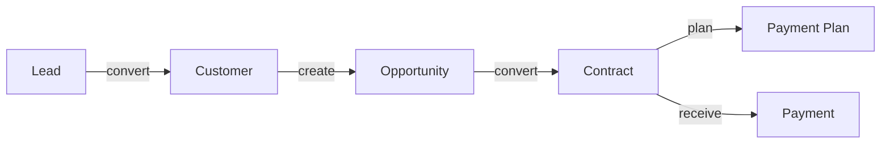

# Sales Pipeline Domain Audit

> **审计日期**: 2026-08-07
> **类型**: 只读业务领域审计（未修改数据库/API/前端/权限）
> **范围**: Lead → Customer → Opportunity → Contract → Payment

---

## Executive Summary

销售闭环领域**已基本完整**，并非空白。五个环节均有数据模型支撑，FK 链路完整，RBAC 已建立。关键结论：

| 环节 | 完成度 | 说明 |
|------|--------|------|
| Lead | ✅ 完成 | 作为 Customer 状态（lead），非独立表 |
| Customer | ✅ 完成 | 完整生命周期 + 公海/分配/跟进 |
| Opportunity | ✅ 完成 | 阶段推进 + stage_log + 金额/概率 |
| Contract | ✅ 完成 | 状态 + approval + opportunity 关联 |
| Payment | ✅ 存在（非缺失） | crm_payment + plan + 4 页面（与任务假设"没有 Payment"不符） |

**主要缺口**：Opportunity→Contract 的自动状态联动（合同签署后商机状态自动推进）未发现；Payment 完整度需单独确认。

---

## Current Architecture

```
crm_customer (主档)
  ├── status: lead/sea/following/quoted/negotiating/signed/lost/paused
  ├── owner_id → 销售归属
  ├── pool_status/pool_type → 公海
  └── last_follow_time → 跟进驱动

crm_opportunity
  ├── customer_id → FK → crm_customer
  ├── stage + win_rate + expected_amount
  └── stage_log (011 migration)

crm_contract
  ├── customer_id → FK → crm_customer
  ├── opportunity_id → FK → crm_opportunity (ON DELETE SET NULL)
  ├── status + approval_status
  └── payment_terms

crm_payment / crm_payment_plan
  ├── contract_id → FK → crm_contract
  └── status: pending/partial/completed/overdue
```

---

## Lead Analysis

**结论**: ✅ 完成（作为 Customer 状态实现）

| 项 | 状态 |
|----|------|
| 数据模型 | `crm_customer.status='lead'`（无独立 crm_lead 表） |
| 潜客池 | leadsService 用 `status=? AND owner_id IS NULL` 查询 |
| 状态 | 通过 CUSTOMER_STATUS.LEAD 管理 |
| 转客户流程 | `api:leads:convert` 权限码存在 |
| 权限 | `api:leads:claim/convert/mark` |

**能力**: Lead 池 + 认领 + 转客户流程已实现。

---

## Customer Analysis

**结论**: ✅ 完成（销售主档）

| 项 | 状态 |
|----|------|
| 生命周期 | 8 状态（lead→sea→following→quoted→negotiating→signed/lost/paused） |
| 归属 | owner_id + create_by |
| 分配 | assignService（api:customer:assign/batch） |
| 公海释放 | poolService（api:customer:release/claim） |
| 跟进记录 | followUpService + crm_follow_up（FK CASCADE） |
| 状态推进 | followUpService 自动推进 new/sea→following |

**确认**: Customer 是销售主档，承担 Lead/Customer 统一载体。

---

## Opportunity Analysis

**结论**: ✅ 完成（MVP 完整）

| 项 | 状态 |
|----|------|
| 创建/编辑 | ✅ router add/update |
| 阶段推进 | ✅ update-stage / backward-stage + stage_log |
| 金额 | ✅ expected_amount + expected_date |
| 概率 | ✅ win_rate |
| 负责人 | ✅ owner_id + checkDataPermission('opportunity','owner_id') |
| 客户关联 | ✅ customer_id（FK） |
| **合同关联** | ⚠️ 表中**无 contract_id**；反向由 crm_contract.opportunity_id 提供 |

**MVP 缺口**:
1. Opportunity 表无直接合同引用（依赖 contract 反向关联）
2. 合同签署后 Opportunity stage 自动推进未发现（需确认）

---

## Contract Analysis

**结论**: ✅ 完成（可作为 Opportunity 后置节点）

| 项 | 状态 |
|----|------|
| 状态 | status (1待执行/2执行中/3已完成/4已取消) + approval_status |
| 客户关联 | ✅ customer_id FK |
| 商机关联 | ✅ opportunity_id FK（ON DELETE SET NULL） |
| 金额 | ✅ amount + payment_terms |
| 生命周期 | approval → 执行 → 完成/取消 |
| 回款 | ✅ contractPaymentService + 合同详情回款计划 |

**确认**: Contract 是 Opportunity 的后置节点（opportunity_id 关联已建立）。

---

## Payment Gap

**结论**: ✅ **已存在**（非缺失）

任务假设"当前没有 Payment"与实际不符。实际已有：

| 项 | 状态 |
|----|------|
| crm_payment 表 | ✅ contract_id + pay_date + pay_amount + plan_id |
| crm_payment_plan 表 | ✅ contract_id + plan_date + plan_amount + status + paid_amount |
| 服务 | ✅ paymentService.js |
| 前端 | ✅ views/payment/（analysis/index/reconciliation/reminders） |
| 合同集成 | ✅ 合同详情含"已回款 + 回款计划" |

**Gap 修正**: Payment 非缺失，而是**已实现**。若需增强，方向是：应收/已收汇总、逾期提醒完善、与财务对账集成（非缺失开发）。

---

## Data Flow



**FK 关系**:
| 关系 | FK | ON DELETE |
|------|-----|-----------|
| Opportunity→Customer | fk_opp_customer | CASCADE |
| Contract→Customer | fk_contract_customer | CASCADE |
| Contract→Opportunity | fk_contract_opportunity | **SET NULL** |
| Payment→Contract | fk_payment_contract | CASCADE |
| PaymentPlan→Contract | fk_payment_plan_contract | CASCADE |
| Quote→Customer/Opportunity | fk_quote_* | CASCADE/SET NULL |

**状态同步**: followUpService 自动推进客户状态（new/sea→following）。

---

## RBAC Analysis

| 模块 | 权限码 | 销售 | 管理员 |
|------|--------|------|--------|
| Customer | customer:add/edit/delete/view + assign/claim/release/import/export | ✅ view/edit/claim | ✅ 全部 |
| Opportunity | opportunity:add/edit/delete | ✅（data_scope self） | ✅（all） |
| Contract | contract:add/update/delete + approval + payment + export | ✅ 创建 | ✅ 全部+审批 |
| Lead | leads:claim/convert/mark | ✅ 认领/转换 | ✅ 全部 |

**数据权限**: 销售 data_scope=self（owner_id 过滤），boss/manager manage_all=true。

---

## Phase 5 Development Recommendation

### 已完成能力（不动）
- Customer Center（稳定，禁止重构）
- Opportunity MVP（阶段推进/金额/概率）
- Contract（状态/审批/opportunity 关联）
- Payment 基础（回款计划/已收）

### 缺失能力（按优先级开发）
| 优先级 | 能力 | 说明 |
|--------|------|------|
| P1 | Opportunity→Contract 状态联动 | 合同签署后商机自动推进 stage |
| P2 | 合同后 Opportunity 关闭 | contract 完成后 opportunity 状态收尾 |
| P3 | Payment 增强 | 应收/已收汇总报表、逾期告警完善 |

### 不应修改的稳定模块
- Customer Center（生命周期/公海/分配已固化）
- Contract 状态机（1-4 已定义并文档化）
- FK 关系（已建立，避免破坏性变更）

---

## 结论

销售管道领域**五环节完整**，核心是"Customer 主档 + Opportunity/Contract/Payment 分支"。主要开发空间在**跨环节状态联动**（合同→商机收尾）和 **Payment 增强**，而非从零开发。任何开发前应先确认 Opportunity→Contract 状态同步现状（本次审计未发现自动联动，需进一步代码确认）。

---

*本审计为只读领域分析，未修改任何代码/数据库/API/权限。*
